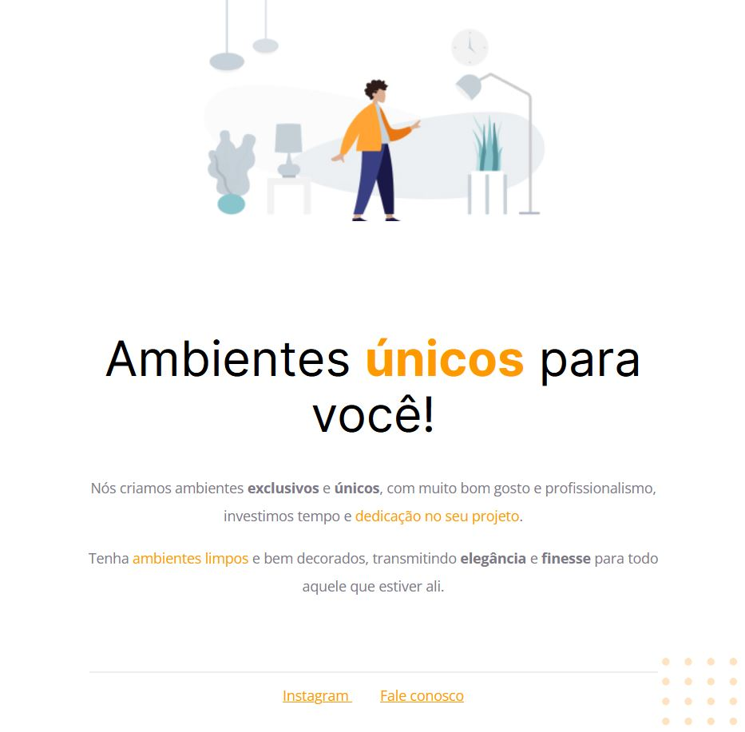

<h1 align="center"> Explorer (Ambientes) </h1>

Página básica para praticar as tecnologias de Front-End e versionamento.  
<a href="https://www.rocketseat.com.br/discover">Aprenda programação clicando aqui.</a>

  <a href="#-tecnologias">Tecnologias</a>&nbsp;&nbsp;&nbsp;|&nbsp;&nbsp;&nbsp;
  <a href="#-projeto">Projeto</a>&nbsp;&nbsp;&nbsp;|&nbsp;&nbsp;&nbsp;
  <a href="#-layout">Layout</a>&nbsp;&nbsp;&nbsp;|&nbsp;&nbsp;&nbsp;
  <a href="#memo-licença">Licença</a>

  

 

  

## 🚀 Tecnologias

Esse projeto foi desenvolvido com as seguintes tecnologias:

- HTML e CSS
- Git e Github
- Figma

## 💻 Projeto

Aumentar o conhecimentos das técnologias mais utilizadas no front-end.

- [Acesse o projeto finalizado, online](https://github.com/Ricardo7484/explorer_pagina_ambientes.git)

- [É iniciante na programação](https://www.rocketseat.com.br/discover)

## :memo: Licença

Esse projeto está sob a licença MIT.

---

Buscando sempre progradir com conhecimento :wave: [🧑‍💻](https://www.linkedin.com/in/ricardo-silvateixeira/)